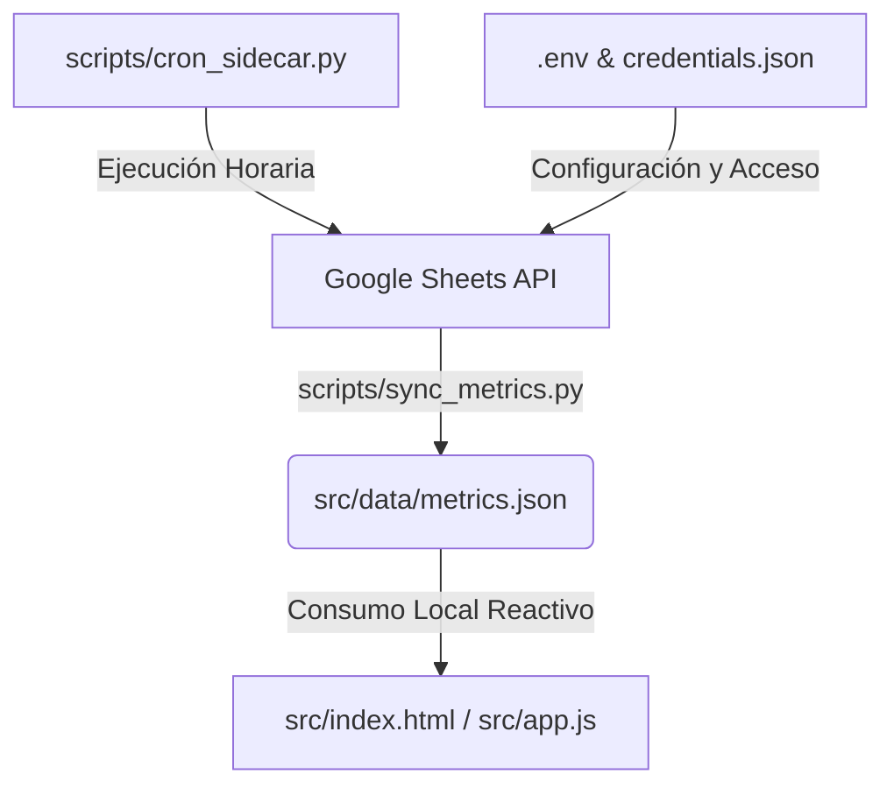

# Coordinación de Subagentes - Dashboard de Métricas CoPA

Este documento define los roles, responsabilidades, flujos de trabajo y límites operativos para los subagentes autónomos de Antigravity 2.0 que participan en el desarrollo y mantenimiento del Dashboard de Métricas de CoPA.

---

## 1. Definición de Agentes y Roles

### A. Agente Desarrollador (Frontend & UI/UX)
- **Objetivo Principal:** Diseñar y construir la interfaz web del dashboard siguiendo los lineamientos de la identidad visual de la institución.
- **Tecnologías:** 
  - HTML5 estático, CSS3 y JavaScript nativo.
  - Librería **Chart.js** (cargada mediante CDN) para la visualización interactiva de datos.
- **Entregables:**
  - [index.html](file:///c:/Users/Leogerman/.antigravity/dashboard_copa/src/index.html): Estructura del dashboard, tarjetas KPI, dos filtros independientes y tablas de detalle.
  - [styles.css](file:///c:/Users/Leogerman/.antigravity/dashboard_copa/src/styles.css): Pautas de estilo basadas en el color institucional rojo (`#D32F2F`) y fondo blanco (`#FFFFFF`).
  - [app.js](file:///c:/Users/Leogerman/.antigravity/dashboard_copa/src/app.js): Lógica de cálculo de KPI, deltas de variación y renderizado interactivo en tiempo real.

### B. Agente de Datos (Integración, Backend & Automatización)
- **Objetivo Principal:** Desarrollar e instrumentar la infraestructura de datos para extraer, limpiar y formatear la información desde el origen.
- **Tecnologías:** Python 3, `gspread`, `google-auth`, `pandas`, `python-dotenv`.
- **Entregables y Scripts:**
  - [sync_metrics.py](file:///c:/Users/Leogerman/.antigravity/dashboard_copa/scripts/sync_metrics.py): Script que se conecta de forma segura mediante OAuth a la API de Google Sheets utilizando la llave en `credentials.json` y genera el caché local consolidado.
  - [cron_sidecar.py](file:///c:/Users/Leogerman/.antigravity/dashboard_copa/scripts/cron_sidecar.py): Daemon sidecar que mantiene el script de sincronización en ejecución automática cada 1 hora.

---

## 2. Límites y Restricciones Operativas (Guardrails)

1. **PROHIBICIÓN de Operaciones de Escritura:**
   - La cuenta de servicio y los scripts tienen permisos estrictamente de **lectura**.
   - Queda estrictamente prohibido intentar realizar operaciones de escritura, edición, eliminación o modificación de fórmulas en las hojas de origen.
2. **Aislamiento Absoluto de Credenciales (Seguridad):**
   - El archivo de llaves privadas `credentials.json` y el entorno `.env` local están estrictamente aislados del código público y se encuentran excluidos mediante el archivo [.gitignore](file:///c:/Users/Leogerman/.antigravity/dashboard_copa/.gitignore).
3. **Persistencia Local y Rate-Limits:**
   - La interfaz web consume los datos estáticos del archivo `src/data/metrics.json` local. Los filtros se recalculan en memoria vía JavaScript en el navegador del cliente para evitar llamadas continuas a la API y superar la cuota diaria de Google Cloud.

---

## 3. Protocolo de Sincronización y Ejecución

- **Paso 1:** El demonio `scripts/cron_sidecar.py` se inicia en segundo plano.
- **Paso 2:** Ejecuta `scripts/sync_metrics.py` y descarga los datos de las pestañas (`base de datos`, `Expedientes`, `Rendición VEP_SCIT`, `Capital financiero`), normalizando fechas y valores numéricos en `src/data/metrics.json`.
- **Paso 3:** Al abrir el dashboard `src/index.html`, la lógica en JavaScript carga el JSON y renderiza los componentes visuales e interactivos de forma inmediata.
